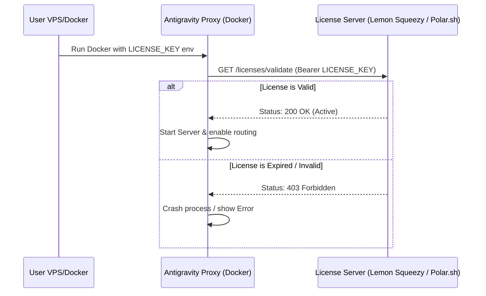

# Strategi Monetisasi: Antigravity Proxy

Dokumen ini menganalisis peluang monetisasi untuk Antigravity Proxy, membandingkan model bisnis **Self-Hosted (Docker Image)** dengan **Hosted SaaS**, serta memberikan rekomendasi implementasi terbaik.

---

## 1. Perbandingan Model Bisnis

| Fitur / Parameter | Model A: Self-Hosted (Jual Docker Image / License) | Model B: Hosted SaaS (Proxy as a Service) |
| :--- | :--- | :--- |
| **Deskripsi** | User membeli lisensi, lalu menjalankan kontainer Docker secara mandiri di server/PC lokal menggunakan akun Google mereka sendiri. | User mendaftar ke server Anda, mendapat API Key, dan langsung memakai proxy Anda tanpa perlu setup server sendiri. |
| **Biaya Server Anda** | **Hampir Rp 0** (Hanya hosting landing page & server lisensi kecil). | **Tinggi** (Menanggung bandwidth lalu lintas data LLM, database session, & monitoring 24/7). |
| **Keamanan & Privasi** | **Sangat Tinggi**. Kode sumber user tidak pernah lewat ke server pihak ketiga (sangat disukai developer). | **Rendah**. Kode sumber user harus melewati server Anda (bisa menjadi penghalang bagi korporat/tim sensitif). |
| **Risiko Akun Diblokir** | **Rendah**. Aktivitas Google Cloud terbagi di IP masing-masing user, sehingga terlihat seperti traffic IDE natural. | **Sangat Tinggi**. Ratusan user mengakses Google dari IP server yang sama akan memicu CAPTCHA & *hard ban* instan. |
| **Kemudahan Penggunaan** | **Medium** (User harus mengerti Docker & cara setup Google OAuth). | **Sangat Tinggi** (Tinggal ganti `BASE_URL` dan masukkan API Key). |
| **Sistem Proteksi** | Menggunakan integrasi License Key verification (misal: Keygen.sh atau Polar.sh). | Menggunakan database user & sistem billing SaaS standard (Stripe/Lemon Squeezy). |

---

## 2. Menurut Lu Bagus Mana? (Rekomendasi)

Untuk project bertipe *bypass proxy* seperti ini, **Model A (Self-Hosted / Jual Docker Image + License Key) jauh lebih baik dan aman.** 

### Alasan Utama:
1. **Delegasi Risiko Banned (Paling Krusial)**: Karena ini mem-bypass Google Cloud Code API, Google sewaktu-waktu bisa memblokir akun yang mencurigakan. Jika Anda menggunakan model SaaS dengan pool akun global milik Anda, satu kali pemblokiran massal dari Google akan langsung mematikan bisnis Anda seketika. Dengan *Self-Hosted*, risiko diblokir ditanggung masing-masing user pada IP mereka sendiri.
2. **Kepercayaan Developer**: Target pasar Anda adalah developer yang menggunakan tools coding (seperti Claude Code, Aider, atau VS Code). Kebanyakan developer sangat sensitif terhadap kerahasiaan kode mereka. Mereka tidak akan mau merutekan request kode mereka melalui server SaaS pihak ketiga yang tidak mereka kelola sendiri.
3. **Biaya Operasional Nol (Zero Overhead)**: Anda tidak perlu pusing memikirkan skalabilitas server, downtime database, atau kuota bandwidth. Anda fokus menulis kode/fitur baru, sementara infrastruktur ditanggung pembeli.

---

## 3. Cara Implementasi Monetisasi Model Self-Hosted

Jika Anda memilih model *Self-Hosted*, Anda tidak perlu membangun sistem login user yang kompleks di dalam server proxy itu sendiri. Anda cukup membuat sistem validasi lisensi sederhana.

### Alur Kerja Validasi Lisensi:

### Langkah Langkah Setup Bisnis:
1. **Gunakan Platform Pembayaran Pihak Ketiga**:
   * Gunakan **Lemon Squeezy**, **Polar.sh**, atau **Gumroad** untuk menjual produk subscription.
   * Platform-platform ini secara otomatis menyediakan generator License Key gratis untuk pembeli Anda.
2. **Proteksi Docker Image**:
   * Jangan publikasikan *source code* asli Anda secara open source.
   * Lakukan kompilasi file TypeScript Anda menjadi single binary menggunakan Bun (`bun build --compile`) lalu masukkan ke dalam Docker image. Ini menyulitkan orang lain untuk melakukan *reverse engineering*.
   * Publikasikan Docker image di registry privat atau public (seperti Docker Hub atau GitHub Packages) dengan mewajibkan environment variable `LICENSE_KEY` saat booting.
3. **Mekanisme Lisensi di Kode**:
   * Pada saat server proxy start (`src/server.ts`), kirim request HTTPS cepat ke API Lemon Squeezy / Polar untuk memverifikasi validitas key tersebut.
   * Simpan hasil verifikasi dalam memori, lalu jalankan verifikasi ulang setiap 24 jam sekali secara background.

---

## 4. Opsi Alternatif: Freemium Dual-License

Jika ingin mendapatkan jangkauan pasar yang lebih luas sekaligus monetisasi yang stabil, Anda bisa menerapkan model **Dual-License**:

1. **Community Edition (Open Source & Gratis)**:
   * Single-user saja (tidak ada sistem dashboard multi-user, tanpa auth).
   * Hanya mendukung rotasi maksimal 2-3 akun Google.
   * Kode didistribusikan secara bebas di GitHub.
2. **Pro/Team Edition (Paid - Docker Image Terproteksi)**:
   * Fitur lengkap sesuai rancangan [`REVAMP.md`](file:///Users/gadingnst/Workspace/nouverse/antigravity-proxy/REVAMP.md) (Multi-user, Admin dashboard, Unlimited account rotation).
   * Dukungan untuk modular router (bisa merutekan ke OpenAI/Anthropic/Open-source model sekaligus).
   * Memerlukan `LICENSE_KEY` bulanan/tahunan untuk digunakan.
