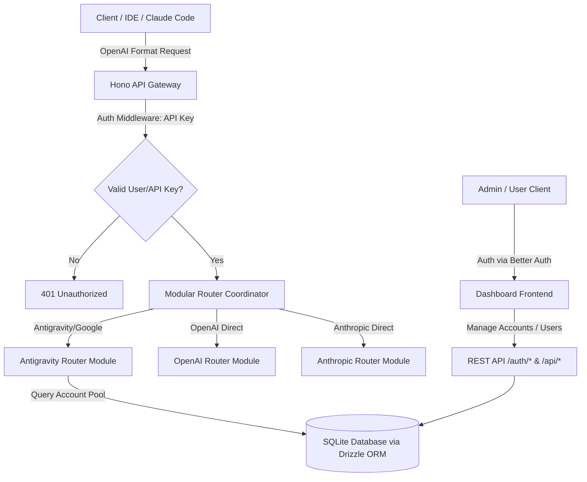

# System Revamp Specification: Multi-User General AI Router

Dokumen ini merinci rencana desain ulang (revamp) **Antigravity Proxy** menjadi **General AI Router** yang mendukung multi-user (Admin & User), manajemen akun mandiri (Self-Service Credentials), routing modular untuk berbagai provider (Antigravity/Google, OpenAI, Anthropic, dll.), serta integrasi **Better Auth** untuk autentikasi yang aman.

---

## 1. Analisis Implementasi Saat Ini (Current State Assessment)

### Apakah implementasi sekarang sudah cukup handal (reliable)?
**Ya, untuk skala penggunaan personal/single-user tunggal.** 
* **Kelebihan**: Mekanisme rotasi *sticky* + *LRU* berjalan baik, sistem penalti *health score* berhasil menyaring akun bermasalah secara dinamis, dan retry logic antar pool meminimalkan kegagalan request.
* **Kelemahan & Limitasi**:
  1. **File-based JSON Storage (`antigravity-accounts.json`)**: Berisiko tinggi mengalami *race condition* atau file korup apabila terjadi penulisan status akun secara konkuren saat traffic tinggi.
  2. **Ketiadaan Autentikasi & Multi-Tenancy**: Semua orang yang bisa mengakses port proxy dapat menggunakan seluruh akun global secara bebas tanpa batas.
  3. **Reactive Token Refresh**: Refresh token baru dilakukan saat request masuk dan token terdeteksi expired, menimbulkan latency spike (delay 1-3 detik) pada request pertama tersebut.

---

## 2. Arsitektur Revamp & Kebutuhan Modularitas

Untuk menjadikannya **General AI Router** yang kompleks dan modular, arsitekturnya diubah menjadi:



### Tech Stack yang Diusulkan:
1. **Runtime**: **Bun** (tetap dipertahankan untuk performa tinggi).
2. **Web Framework**: **Hono** (menggantikan standard `Bun.serve` untuk mempermudah middleware, sub-routing modular, dan integrasi Better Auth).
3. **Database**: **SQLite** (menggunakan driver `bun:sqlite` bawaan Bun) + **Drizzle ORM** untuk type-safe database queries dan migrasi schema.
4. **Authentication**: **Better Auth** (menyediakan login Email/Password, session management, dan Role-Based Access Control).

---

## 3. Database Schema (Drizzle ORM)

Untuk mengakomodasi relasi antara **User**, **API Keys**, dan **Google Accounts**, schema database SQLite dirancang sebagai berikut:

```typescript
import { sqliteTable, text, integer } from "drizzle-orm/sqlite-core";

// Tabel User (Dikelola oleh Better Auth & Admin)
export const users = sqliteTable("user", {
  id: text("id").primaryKey(),
  email: text("email").notNull().unique(),
  name: text("name"),
  passwordHash: text("password_hash").notNull(),
  role: text("role").$type<"admin" | "user">().default("user").notNull(),
  createdAt: integer("created_at", { mode: "timestamp" }).notNull(),
  updatedAt: integer("updated_at", { mode: "timestamp" }).notNull(),
});

// Tabel Session (Dikelola oleh Better Auth)
export const sessions = sqliteTable("session", {
  id: text("id").primaryKey(),
  userId: text("user_id").notNull().references(() => users.id, { onDelete: "cascade" }),
  token: text("token").notNull().unique(),
  expiresAt: integer("expires_at", { mode: "timestamp" }).notNull(),
  ipAddress: text("ip_address"),
  userAgent: text("user_agent"),
  createdAt: integer("created_at", { mode: "timestamp" }).notNull(),
  updatedAt: integer("updated_at", { mode: "timestamp" }).notNull(),
});

// Tabel API Keys milik User untuk autentikasi request LLM
export const apiKeys = sqliteTable("api_key", {
  id: text("id").primaryKey(),
  userId: text("user_id").notNull().references(() => users.id, { onDelete: "cascade" }),
  key: text("key").notNull().unique(), // format: agp_live_...
  name: text("name").notNull(), // label key (misal: "Claude Code Key")
  createdAt: integer("created_at", { mode: "timestamp" }).notNull(),
  expiresAt: integer("expires_at", { mode: "timestamp" }),
  isActive: integer("is_active", { mode: "boolean" }).default(true).notNull(),
});

// Tabel Akun Google milik User (untuk Antigravity Pool)
export const googleAccounts = sqliteTable("google_account", {
  id: text("id").primaryKey(),
  userId: text("user_id").notNull().references(() => users.id, { onDelete: "cascade" }),
  email: text("email").notNull(),
  // Kredensial disimpan terenkripsi secara aman
  credentials: text("credentials").notNull(), // JSON: { clientId, clientSecret, refreshToken, accessToken, expiry }
  pool: text("pool").$type<"sandbox" | "cli">().default("sandbox").notNull(),
  healthScore: integer("health_score").default(100).notNull(),
  status: text("status").$type<"ready" | "rate_limited" | "challenge_required" | "error">().default("ready").notNull(),
  cooldownUntil: integer("cooldown_until", { mode: "timestamp" }),
  createdAt: integer("created_at", { mode: "timestamp" }).notNull(),
  updatedAt: integer("updated_at", { mode: "timestamp" }).notNull(),
});

// Tabel Log Penggunaan untuk Audit & Kuota
export const usageLogs = sqliteTable("usage_log", {
  id: text("id").primaryKey(),
  userId: text("user_id").references(() => users.id, { onDelete: "set null" }),
  apiKeyId: text("api_key_id").references(() => apiKeys.id, { onDelete: "set null" }),
  provider: text("provider").notNull(), // 'antigravity', 'openai', dll.
  model: text("model").notNull(),
  promptTokens: integer("prompt_tokens").default(0).notNull(),
  completionTokens: integer("completion_tokens").default(0).notNull(),
  status: integer("status").notNull(), // HTTP Status code
  latencyMs: integer("latency_ms").notNull(),
  timestamp: integer("timestamp", { mode: "timestamp" }).notNull(),
});
```

---

## 4. Konfigurasi Better Auth (Integrasi Hono)

Better Auth akan diatur sebagai middleware di server Hono untuk mengontrol autentikasi berbasis session di panel dashboard, sementara API router utama akan diautentikasi menggunakan API Keys.

```typescript
// src/auth/better-auth.ts
import { betterAuth } from "better-auth";
import { drizzleAdapter } from "better-auth/adapters/drizzle";
import { db } from "../db/client"; // Drizzle client

export const auth = betterAuth({
  database: drizzleAdapter(db, {
    provider: "sqlite",
  }),
  emailAndPassword: {
    enabled: true,
  },
  // Menggunakan plugin multi-tenancy atau custom claims untuk Role (Admin & User)
  plugins: [], 
});
```

---

## 5. Rancangan Routing Modular (General AI Router)

Untuk mendukung penambahan provider di masa mendatang secara mudah, router dipisahkan menjadi modul terpisah dengan antarmuka (interface) yang seragam.

### Base Interface: `src/routers/types.ts`
```typescript
import { Context } from "hono";

export interface ProviderRouter {
  providerId: string;
  supportsModel(model: string): boolean;
  handleChatCompletion(c: Context, payload: any, userId: string): Promise<Response>;
}
```

### Struktur Folder Modular:
```
src/
├── db/                 # Database client & migrations
├── auth/               # Better Auth initialization
├── middleware/         # Hono middlewares (Auth, rate limit, logging)
├── routers/            # Modul Router Provider
│   ├── index.ts        # Coordinator Router (menentukan modul yang dipakai)
│   ├── antigravity.ts  # Modul Antigravity (Google bypass logic)
│   ├── openai.ts       # Modul forward langsung ke OpenAI
│   └── anthropic.ts    # Modul forward langsung ke Anthropic
└── server.ts           # Server entry point
```

### Coordinator Router: `src/routers/index.ts`
```typescript
import { Context } from "hono";
import { AntigravityRouter } from "./antigravity";
import { OpenAIRouter } from "./openai";
import { ProviderRouter } from "./types";

const registeredRouters: ProviderRouter[] = [
  new AntigravityRouter(),
  new OpenAIRouter(),
  // Tambahkan provider lain di sini
];

export async function routeLLMRequest(c: Context, payload: any, userId: string): Promise<Response> {
  const model = payload.model;
  
  // Cari router yang mendukung model tersebut
  const targetRouter = registeredRouters.find(r => r.supportsModel(model));
  
  if (!targetRouter) {
    return c.json({
      error: {
        message: `Model '${model}' is not supported by any registered provider.`,
        type: "invalid_request_error"
      }
    }, 400);
  }
  
  return targetRouter.handleChatCompletion(c, payload, userId);
}
```

---

## 6. Skenario REST API Endpoints

### Auth & User Management (Better Auth & Custom Admin Endpoints)
* `POST /api/auth/sign-up` -> Pendaftaran user baru (Bisa dibatasi hanya Admin jika registrasi publik ditutup).
* `POST /api/auth/sign-in` -> Login user/admin.
* `POST /api/auth/sign-out` -> Logout session.
* `GET /api/admin/users` -> [Admin Only] List semua user terdaftar.
* `POST /api/admin/users` -> [Admin Only] Admin membuat user baru dengan email & password sementara.
* `DELETE /api/admin/users/:id` -> [Admin Only] Menghapus user.

### User Dashboard (Self-Service)
* `GET /api/user/keys` -> Melihat daftar API Key aktif milik user tersebut.
* `POST /api/user/keys` -> Membuat API Key baru (`agp_live_...`) untuk aplikasi luar.
* `DELETE /api/user/keys/:id` -> Menonaktifkan / menghapus API Key.
* `GET /api/user/accounts` -> Melihat daftar Google Account yang didaftarkan oleh user ini.
* `POST /api/user/accounts` -> User menambahkan Google Account baru (menginput OAuth Client ID, Client Secret, & Refresh Token).
* `DELETE /api/user/accounts/:id` -> Menghapus akun Google milik user dari pool.

### Core LLM Endpoint (OpenAI-Compatible)
* `POST /v1/chat/completions` -> Endpoint utama untuk Chat.
  * Harus mengirim header `Authorization: Bearer agp_live_...`.
  * Middleware memverifikasi token API Key, mengidentifikasi `userId`, lalu mencari akun Google milik user tersebut di database untuk memproses request (jika menggunakan router Antigravity).

---

## 7. Desain Antarmuka Baru (Dashboard Frontend)

Dashboard frontend diubah menjadi antarmuka multi-tenant modern dengan struktur:
1. **Halaman Login & Register**: Dibangun menggunakan component Better Auth.
2. **Dashboard Overview (User)**:
   * Menampilkan statistik penggunaan token per hari.
   * Daftar API Keys aktif dengan opsi generate & revoke.
   * Manajemen Akun Google: List akun, status kesehatan (health score), status (ready/challenge), dan tombol "Add Account" dengan form OAuth.
3. **Dashboard Admin (Admin Only)**:
   * List manajemen User (tambah, hapus, reset password).
   * Statistik performa global seluruh proxy.

---

## 8. Langkah Implementasi & Migrasi

1. **Tahap 1: Setup Infrastructure**
   * Install Hono, Drizzle ORM, Drizzle-kit, dan Better Auth.
   * Inisialisasi SQLite database dan buat schema database.
2. **Tahap 2: Implementasi Autentikasi**
   * Setup endpoint Better Auth (`/api/auth/*`).
   * Buat API Key generator dan API Key verification middleware.
3. **Tahap 3: Modularisasi Router**
   * Pindahkan logic `src/server.ts` saat ini ke `src/routers/antigravity.ts`.
   * Sesuaikan pengambilan akun Google dari file JSON menjadi query database SQLite berdasarkan `userId` pembuat request.
4. **Tahap 4: Dashboard Panel & UI**
   * Integrasikan dashboard frontend baru dengan API Hono dan autentikasi Better Auth.
